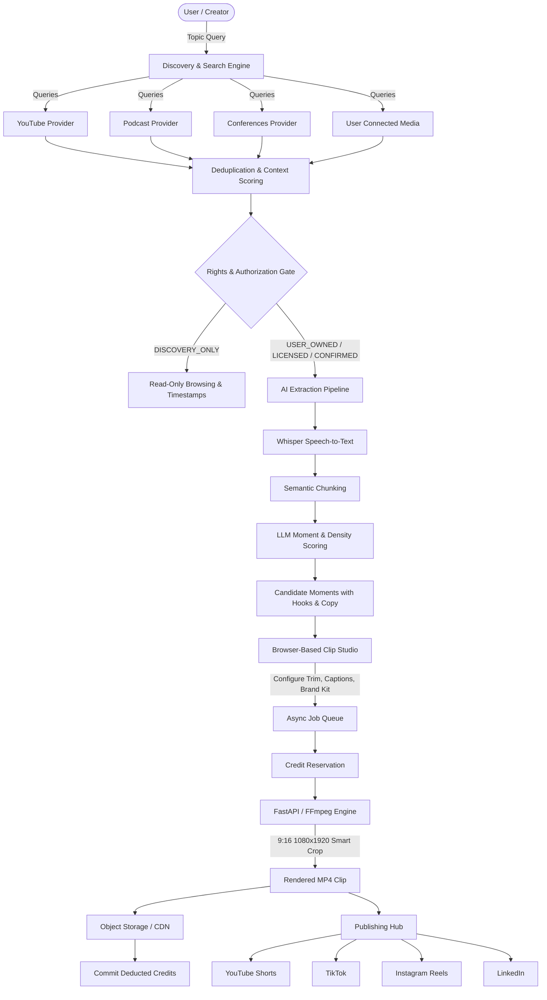

# SignalCut — System Architecture & Design

SignalCut is an AI-powered content discovery and repurposing platform designed around a **Topic-First** philosophy. Rather than requiring users to manually hunt down and feed video URLs into a clipper, users start with any topic, keyword, question, trend, person, company, product, or niche.

---

## 1. Clean Architecture Breakdown

The backend is built in C# (.NET 8/10 LTS) adhering strictly to Clean Architecture principles:

### `SignalCut.Domain`
- **Zero external dependencies**: encapsulates enterprise entities, value objects, and domain enums.
- **Core Entities**: `User`, `Organization`, `Project`, `Search`, `Source`, `SourceItem`, `Transcript`, `TranscriptChunk`, `Moment`, `MediaAsset`, `Clip`, `Job`, `CreditWallet`, `CreditTransaction`, `Payment`, `PublishingAccount`, `PublishingJob`, `UsageRecord`, `AuditLog`.
- **Enums**: `RightsStatus`, `AuthorizationStatus`, `MomentObjective`, `JobStatus`, `CreditTransactionType`, `PaymentStatus`, `PublishingPlatform`.

### `SignalCut.Application`
- **Business Logic & Use Cases**: orchestrates discovery, credit verification, moment analysis, and rendering queues.
- **Provider Interfaces**: `ISourceProvider`, `ISearchProvider`, `ITranscriptProvider`, `IMediaProvider`, `ILanguageModelProvider`, `ISpeechToTextProvider`, `IVideoProcessor`, `IPublishingProvider`, `IPaymentProvider`, `IObjectStorage`.
- **Validation**: FluentValidation rules for incoming requests.
- **Exceptions**: Specialized exception classes (`InsufficientCreditsException`, `UnauthorizedMediaException`, `TenantAccessDeniedException`, `ValidationException`, `ConflictException`, `SecurityException`).

### `SignalCut.Infrastructure`
- **Database Persistence**: Entity Framework Core with PostgreSQL (`SignalCutDbContext`), complete indexing, soft-deletion filters, and atomic ledger management.
- **Provider Implementations**:
  - `AggregatedSearchProvider` multi-provider query aggregation and scoring.
  - `CompositeLanguageModelProvider` supporting OpenAI, Anthropic, Gemini, and fallback local high-signal analysis.
  - `CompositeVideoProcessor` communicating with FastAPI worker and direct local FFmpeg.
  - `MediaSecurityValidator` preventing Server-Side Request Forgery (SSRF).
  - `StripePaymentProvider` & `RazorpayPaymentProvider` with signature verification.
  - `AesTokenEncryptionService` AES-256-GCM encryption for stored OAuth credentials.

### `SignalCut.API`
- **ASP.NET Core REST Endpoints**: Versioned `/api/v1/` controllers.
- **Middleware**: `ExceptionHandlingMiddleware` for sanitized, structured error envelopes; `TenantIsolationMiddleware` for multi-tenant boundary enforcement; JWT Bearer authentication.

---

## 2. Python / FastAPI AI Worker (`ai-worker/`)

Heavy media workloads, frame extraction, dynamic subtitle burning, and FFmpeg filter graphs run as an asynchronous microservice:
- `/api/v1/transcription`: Speech-to-text chunking with speaker diarization.
- `/api/v1/analyze`: Information density scoring and thematic clustering.
- `/api/v1/moments`: Objective-specific moment detection (Educational, Controversial, Newsworthy, etc.).
- `/api/v1/render`: 9:16 vertical render engine generating 1080x1920 MP4 files with animated captions, brand colors, progress bars, and free-tier watermarks.
