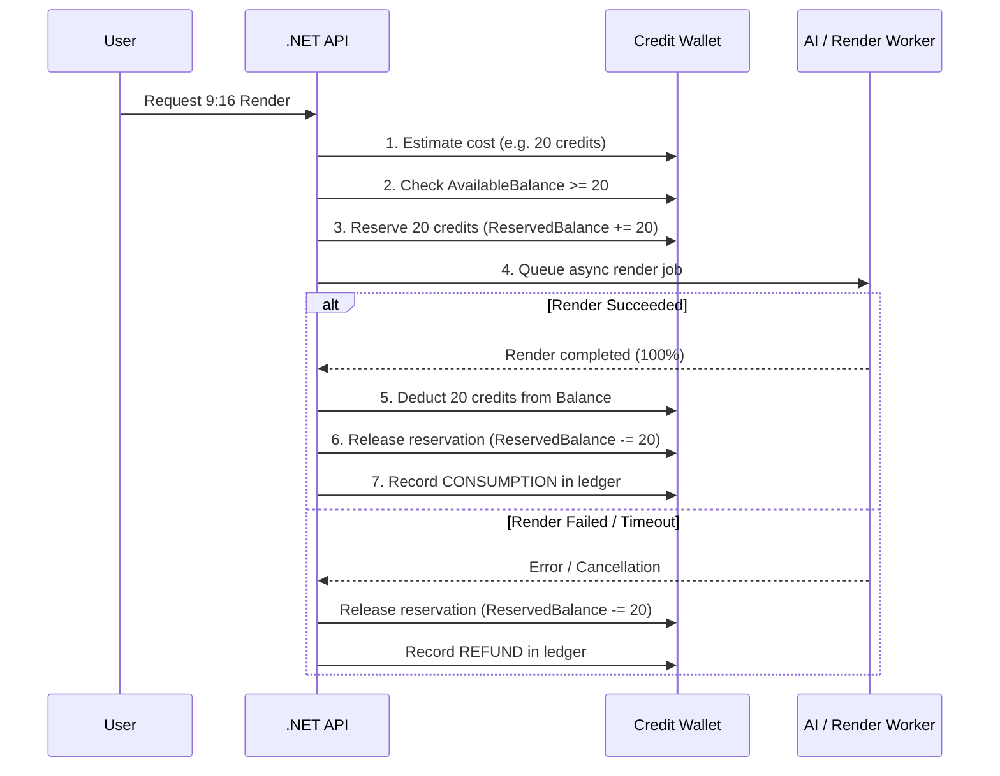

# SignalCut — Cost Control & Credit Wallet Mechanics

To prevent unbounded AI operational expenses and protect unit economics, SignalCut operates on a strict **Pay-As-You-Go Credit Ledger** model rather than unlimited subscriptions.

---

## 1. Credit Pricing Architecture

Credit packages are configured server-side and manageable by administrators:
- **Starter Pack**: ₹100 → 100 Credits (1.00 credit/₹)
- **Creator Pro**: ₹500 → 550 Credits (+50 Bonus, 1.10 credits/₹)
- **Agency Scale**: ₹1,000 → 1,200 Credits (+200 Bonus, 1.20 credits/₹)

### Operations Cost Table:

| Operation | Base Credits | Unit Rate |
|---|:---:|---|
| Speech-to-Text Transcription | 5 | ~5 credits / 30 mins |
| AI Moment Detection & Scoring | 10 | Flat per source analysis |
| AI Copywriting (Hook, Caption, CTA) | 5 | Flat per regenerate |
| 1080p 9:16 Video Rendering | 15–25 | ~0.4 credits / second |

---

## 2. The 7-Step Reservation Lifecycle

Expensive asynchronous operations never deduct directly from `Balance` without reservation.

---

## 3. Hard Safety Limits

Malformed or abusive requests are bounded by strict configuration thresholds:
- `MAX_SEARCH_RESULTS`: 50
- `MAX_TRANSCRIPT_LENGTH`: 100,000 characters
- `MAX_VIDEO_DURATION`: 180 seconds (3 minutes)
- `MAX_LLM_TOKENS`: 1,500
- `MAX_CONCURRENT_JOBS`: 5 per organization
- `MAX_RETRIES`: 3 attempts (retries never double-charge credits)
