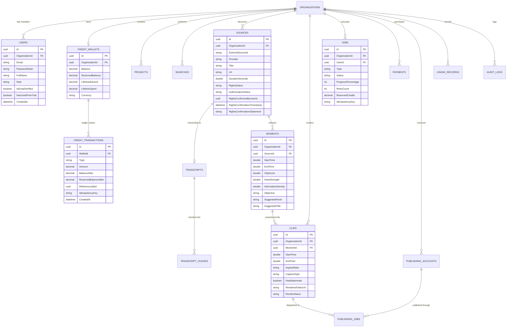

# SignalCut — Database Schema & ER Diagram

The database schema is designed for PostgreSQL with UUID primary keys, UTC timestamps, soft-deletion auditing, multi-tenant isolation via `OrganizationId`, and an immutable ledger pattern for billing.

---

## Key Invariants & Safeguards

1. **Credit Wallet Derivability**:
   `Wallet.AvailableBalance = Wallet.Balance - Wallet.ReservedBalance`.
   Every balance mutation must be accompanied by an immutable `CreditTransaction` row.
2. **Negative Balance Prevention**:
   The balance constraint ensures that `Balance >= 0` and `AvailableBalance >= 0` at all times.
3. **Tenant Boundary**:
   Every tenant-scoped query filters on `OrganizationId`. Cross-tenant querying is prevented at both the database and middleware layers.
4. **Idempotency Uniqueness**:
   `Payment.IdempotencyKey` and `CreditTransaction.IdempotencyKey` prevent duplicate credits upon webhook retries.
